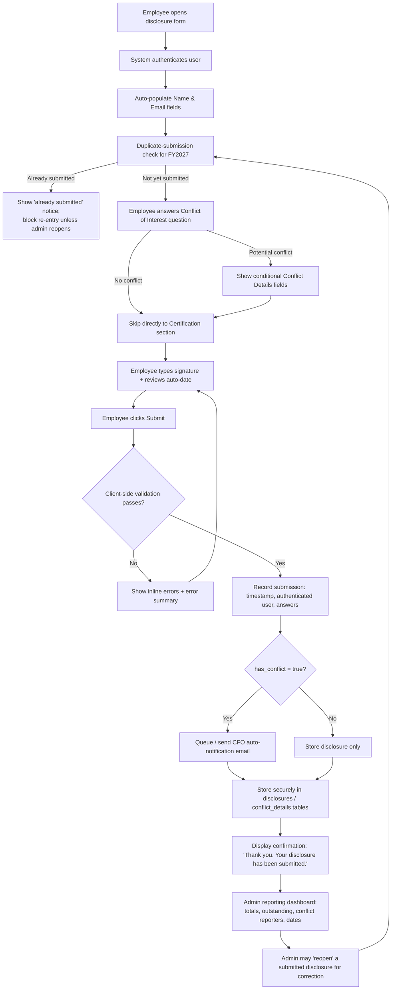

# Walton County, Florida — Financial Conflict of Interest Disclosure Form

**Fiscal Year 2027 Specification**

| | |
|---|---|
| **Status** | Draft for Review |
| **Version** | 1.0 |
| **Date** | 2026-07-22 |
| **Applies to** | All Walton County employees |
| **Legal basis** | Florida Statutes Chapter 112.311 (Code of Ethics for Public Officers and Employees); Walton County HR Policy (Conflict of Interest, policy number TBD by HR) |

---

## 1. Complete Form Specification

### 1.1 Purpose and Scope

Florida law and Walton County HR policy require every county employee to annually disclose any actual or potential financial, personal, business, or other interest that conflicts — or could appear to conflict — with their public duties. This form is the annual mechanism for that disclosure for **Fiscal Year 2027** and must be completed by every active employee, regardless of role or department.

### 1.2 Legal Basis

This disclosure requirement is grounded in **Florida Statutes Chapter 112.311**, which establishes the standards of conduct for public officers and employees, including the presumption that public office/employment is a public trust and that officers/employees must avoid conflicts between private interests and public duties. It is further implemented through **Walton County HR policy** governing employee conduct and conflict-of-interest reporting.

### 1.3 Introductory Statement (displayed verbatim on the form)

> No employee or official shall have a direct or indirect financial, personal, business, or other interest that conflicts or appears to conflict with public duties. Employees are required to disclose any actual or potential conflicts annually.

A citation line accompanies this statement: *"Per Florida Statutes § 112.311 and Walton County HR Policy."*

### 1.4 Field-by-Field Walkthrough (submission order)

1. **Employee Name** — required. Auto-populated from the authenticated session if the employee is logged in via the county's identity system; otherwise entered manually.
2. **Employee Email** — required. Auto-populated from the authenticated session where available.
3. **Employee ID** — required. County-assigned employee/badge number; serves as the unique identifier for duplicate-submission prevention (see §4).
4. **Conflict of Interest Question** — required. A single-choice question:
   - "I have no potential conflict of interest."
   - "I have a potential conflict of interest."
5. **Conditional Conflict Details** — displayed only when "I have a potential conflict of interest" is selected (see §3 Conditional Logic):
   - Name of business or person with the conflict of interest
   - Nature of relationship
   - Description of the conflict
   - Financial interest (Yes/No)
   - Personal relationship (Yes/No)
   - Business relationship (Yes/No)
   - Date conflict began
   - Additional comments
6. **Certification** — required for every submission, regardless of conflict status:
   - Statement: *"I certify that this information is true and complete to the best of my knowledge. I understand that any future conflicts must be disclosed immediately."*
   - Electronic signature (typed full name)
   - Certification date (auto-generated, read-only)
7. **Submission Confirmation** — on successful submit, the form displays: *"Thank you. Your disclosure has been submitted."*

### 1.5 Non-Functional Requirements

- **Mobile-friendly**: fully usable on phone-sized viewports; touch targets sized for finger input.
- **Accessible**: target WCAG 2.1 AA — visible focus states, labeled fields, error messages tied to fields via ARIA, sufficient color contrast, no color-only signaling.
- **Concise**: single scrolling page, no multi-page wizard; conditional logic keeps the form short for employees with nothing to disclose.
- **Annual recurrence**: exactly one disclosure per employee per fiscal year unless an administrator reopens a prior submission for correction.
- **Government branding**: professional, modern civic look consistent with Walton County's public-facing identity, without reproducing any official seal/logo the design team hasn't supplied.

---

## 2. Recommended Field Types

| Field | HTML Input Type | Required | Max Length | Notes |
|---|---|---|---|---|
| Employee Name | `text` | Yes | 100 | Auto-populated from auth session when available |
| Employee Email | `email` | Yes | 150 | Auto-populated from auth session; HTML5 + regex validation |
| Employee ID | `text` (`inputmode="numeric"`) | Yes | 20 | County badge/employee number; unique identifier used for duplicate-submission prevention |
| Conflict of Interest Question | `radio` (2 options) | Yes | — | Drives conditional section |
| Name of Business or Person with Conflict of Interest | `text` | Required if conflict = yes | 200 | |
| Nature of Relationship | `select` (Employment, Ownership/Investment, Family/Personal, Gift/Gratuity, Other) | Required if conflict = yes | — | "Other" reveals a follow-up free-text field |
| Nature of Relationship (Other, free text) | `text` | Required if "Other" selected | 200 | |
| Description of the Conflict | `textarea` | Required if conflict = yes | 1000 | Character counter recommended |
| Financial Interest | `radio` (Yes/No) | Required if conflict = yes | — | |
| Personal Relationship | `radio` (Yes/No) | Required if conflict = yes | — | |
| Business Relationship | `radio` (Yes/No) | Required if conflict = yes | — | |
| Date Conflict Began | `date` | Required if conflict = yes | — | Must not be a future date |
| Additional Comments | `textarea` | No | 1000 | |
| Certification Checkbox | `checkbox` | Yes | — | Must be checked before signature is enabled |
| Electronic Signature (typed name) | `text` | Yes | 150 | Enabled only once certification checkbox is checked |
| Certification Date | `text` (read-only) | System-generated | — | Not user-editable; set from client/system clock at submission |

---

## 3. Conditional Logic

| Rule | Trigger | Effect |
|---|---|---|
| **C1** | Selecting "I have a potential conflict of interest" | Reveals the Conflict Details section; its fields become required |
| **C2** | Selecting "I have no potential conflict of interest" | Conflict Details section stays hidden and its fields are not required; the employee proceeds directly from the question to Certification |
| **C3** | Selecting "Other" under Nature of Relationship | Reveals a follow-up free-text field to describe the relationship |
| **C4** | Certification checkbox is checked | Enables the electronic signature field and auto-populates the certification date |
| **C5** | Certification checkbox is unchecked (after being checked) | Disables and clears the signature field so an unconfirmed signature cannot be submitted |

The form's DOM order is: employee info → conflict question → (conditional) conflict details → certification. This ordering means employees who select "no conflict" have a visibly and functionally shorter path — they skip straight to certification without ever seeing the conflict-details fields.

---

## 4. Validation Rules

- **Required-field validation** runs on submit (not on every keystroke/blur), with an accessible error summary at the top of the form (`role="alert"`) and inline messages next to each invalid field, linked via `aria-describedby` and `aria-invalid`.
- **Email format**: must match a valid email pattern (HTML5 `type="email"` plus a regex check).
- **Conditional-required fields**: the 8 conflict-detail fields are only validated as required when the Conflict of Interest Question is answered "yes."
- **Date validation**: "Date Conflict Began" cannot be a future date.
- **Certification validation**: submission is blocked unless the certification checkbox is checked **and** the electronic signature field is non-empty.
- **Duplicate-submission prevention**: an employee, identified by Employee ID, may not submit more than one disclosure per fiscal year. In production this is enforced server-side/at the database layer, keyed on employee ID + fiscal year (see §5, unique constraint on `disclosures`); administrators can "reopen" a prior submission to allow a correction, which supersedes the old record rather than deleting it.
- **Focus management**: on a failed submit, focus moves to the error summary so keyboard and screen-reader users immediately see what needs correcting.

---

## 5. Suggested Database Schema

Postgres-flavored DDL. All tables use UUID primary keys and `TIMESTAMPTZ` for audit fields.

```sql
CREATE TABLE employees (
    employee_id             UUID PRIMARY KEY DEFAULT gen_random_uuid(),
    county_employee_number  VARCHAR(20) UNIQUE NOT NULL,
    full_name               VARCHAR(150) NOT NULL,
    email                   VARCHAR(150) UNIQUE NOT NULL,
    department              VARCHAR(100),
    active                  BOOLEAN NOT NULL DEFAULT TRUE,
    created_at              TIMESTAMPTZ NOT NULL DEFAULT now(),
    updated_at              TIMESTAMPTZ NOT NULL DEFAULT now()
);

CREATE TABLE disclosures (
    disclosure_id           UUID PRIMARY KEY DEFAULT gen_random_uuid(),
    employee_id             UUID NOT NULL REFERENCES employees(employee_id),
    fiscal_year             SMALLINT NOT NULL,
    has_conflict            BOOLEAN NOT NULL,
    certification_signature VARCHAR(150) NOT NULL,
    certification_date      TIMESTAMPTZ NOT NULL,
    submitted_at            TIMESTAMPTZ NOT NULL DEFAULT now(),
    submitted_by_user_id    UUID NOT NULL,
    status                  VARCHAR(20) NOT NULL DEFAULT 'submitted'
                                CHECK (status IN ('submitted', 'reopened', 'superseded')),
    ip_address              INET,
    -- Enforces one active submission per employee per fiscal year;
    -- an admin "reopen" flips the old row to 'superseded' before a new one is created.
    UNIQUE (employee_id, fiscal_year, status) DEFERRABLE INITIALLY IMMEDIATE
);

CREATE TABLE conflict_details (
    conflict_detail_id      UUID PRIMARY KEY DEFAULT gen_random_uuid(),
    disclosure_id           UUID NOT NULL UNIQUE REFERENCES disclosures(disclosure_id),
    vendor_organization     VARCHAR(200) NOT NULL,
    relationship_nature     VARCHAR(50) NOT NULL
                                CHECK (relationship_nature IN
                                    ('employment', 'ownership', 'family', 'gift', 'other')),
    relationship_nature_other VARCHAR(200),
    description             TEXT NOT NULL,
    financial_interest      BOOLEAN NOT NULL,
    personal_relationship   BOOLEAN NOT NULL,
    business_relationship   BOOLEAN NOT NULL,
    conflict_began_date     DATE NOT NULL,
    additional_comments     TEXT
);

CREATE TABLE notifications (
    notification_id         UUID PRIMARY KEY DEFAULT gen_random_uuid(),
    disclosure_id           UUID NOT NULL REFERENCES disclosures(disclosure_id),
    recipient_email         VARCHAR(150) NOT NULL,  -- CFO address
    sent_at                 TIMESTAMPTZ,
    status                  VARCHAR(20) NOT NULL DEFAULT 'queued'
                                CHECK (status IN ('queued', 'sent', 'failed'))
);
```

### Reporting Views

```sql
-- Total submissions vs. total active employees, by fiscal year
CREATE VIEW v_submission_summary AS
SELECT d.fiscal_year,
       COUNT(*) FILTER (WHERE d.status = 'submitted') AS total_submissions,
       (SELECT COUNT(*) FROM employees WHERE active) AS total_active_employees
FROM disclosures d
GROUP BY d.fiscal_year;

-- Employees with no submitted disclosure for the current fiscal year
CREATE VIEW v_outstanding_employees AS
SELECT e.*
FROM employees e
LEFT JOIN disclosures d
       ON d.employee_id = e.employee_id
      AND d.fiscal_year = EXTRACT(YEAR FROM now())::SMALLINT
      AND d.status = 'submitted'
WHERE e.active AND d.disclosure_id IS NULL;

-- Employees who disclosed a conflict, joined to the details
CREATE VIEW v_conflict_reporters AS
SELECT e.full_name, e.email, d.fiscal_year, cd.*
FROM disclosures d
JOIN employees e ON e.employee_id = d.employee_id
JOIN conflict_details cd ON cd.disclosure_id = d.disclosure_id
WHERE d.has_conflict AND d.status = 'submitted';

-- Submission dates, for tracking completion pace
CREATE VIEW v_submission_timeline AS
SELECT fiscal_year, date_trunc('day', submitted_at) AS submission_day, COUNT(*) AS submissions
FROM disclosures
WHERE status = 'submitted'
GROUP BY fiscal_year, submission_day
ORDER BY submission_day;
```

These views back the required admin reports: **total submissions**, **outstanding employees**, **employees reporting conflicts**, and **submission dates**.

---

## 6. Workflow Diagram



### Notes on the diagram vs. the included prototype

The accompanying static prototype (`/prototype`) implements the client-facing steps of this workflow — authentication, auto-population, conditional logic, validation, the confirmation message, and a duplicate-submission check — using a mocked demo login and the browser's `localStorage` in place of a real backend. It intentionally does **not** implement:

- Step B (real authentication) — production would integrate with the county's identity provider.
- Step L/P (durable storage) — production would write to the Postgres schema in §5 over an authenticated API.
- Step N (CFO notification) — production would trigger a transactional email (e.g., via SES/SendGrid) recorded in the `notifications` table.
- Step R/S (admin reporting and reopen workflow) — production would be a separate authenticated admin dashboard built on the reporting views in §5.

These are called out explicitly in the prototype's code comments and UI so it is not mistaken for a production-ready system.
